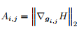

## 摘要
作者在reid问题中使用了attention的思想，在cuhk01与cuhk03数据集中取得了不错的效果
## 模型结构

模型结构如上所示，由两部分组成 Global attention layer以及local deep cnn
attention通过global模型的梯度传播来实现。
m
### Global attention layer
global attention layer由两个卷积层以及全连接层，maxpooling层及softmax层组成。
将前两个卷积层的操作以符号fg(I)来表示，其中I表示图像
其实现的操作为 来实现
经过两层卷积，得到的结果为
其中s1，s2表示相应的空间位置。然后得到gi,j(feature map)经过全连接层等得到一个向量输出

计算熵，由熵求对应位置的梯度，将梯度作为相应的激活map

那么attention图像即可得到
那么attention机制就是这样实现的，通过选取attention较高的区域，进一步输入到local deep cnn中去，提取局部特征。

混合特征可以如此实现

we are replacing the global features corresponding to the attended regions with the rich local features.
关于训练，这里面提了一下

